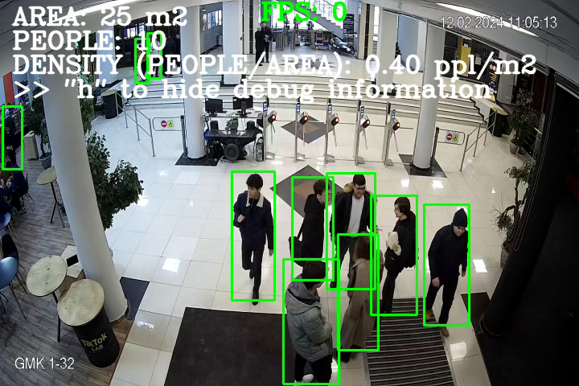
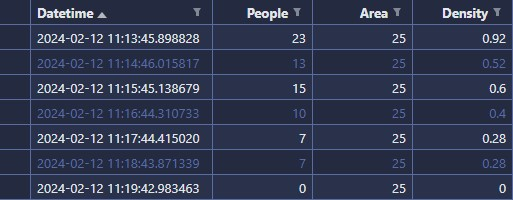
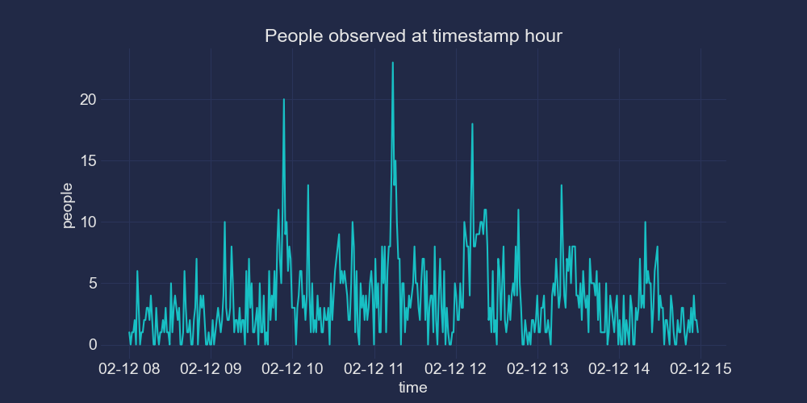
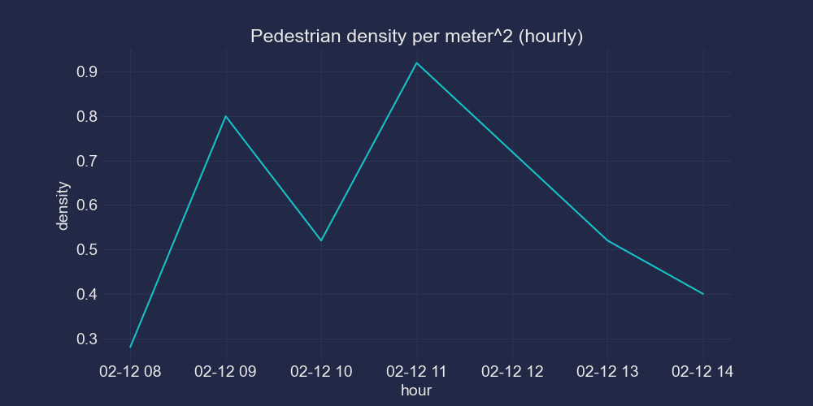

# Population Density Tracker
This is a Computer Vision solution for logging population density over time. 

## Pedestrian density tracker
It is a simple pedestrian counting model utilizing YOLOv5 + basic maths for density calculation:

Sample results (elapsed every minute):

## Plots

## LICENSE
All code is licensed under the MIT license.

